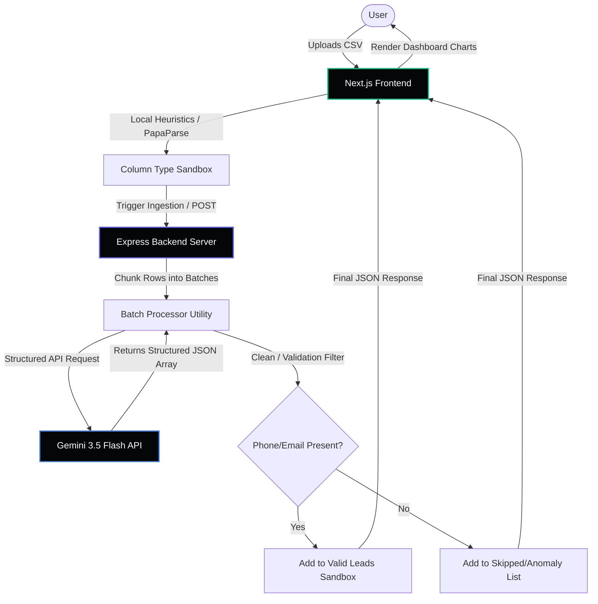
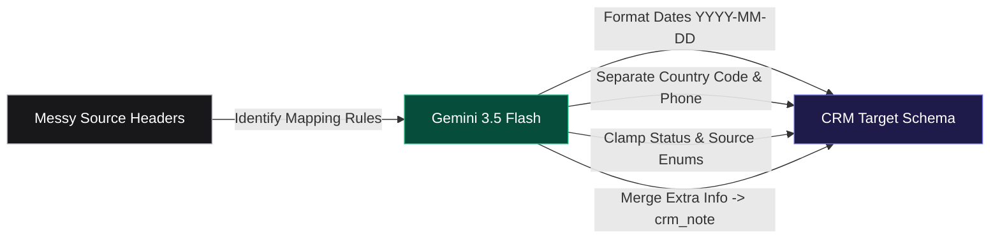

# 🚀 GrowEasy AI CSV Importer


An **AI-powered CSV schema importer** that utilizes **Google Gemini 3.5 Flash** to intelligently map, clean, and structure arbitrary CSV files into a standardized CRM database layout. Upload messy exports, raw excel dumps, or native files — the AI cleans, validates, and imports the data in optimized batches.

---

## 🎨 Visual Tour (SaaS Dashboard UI)

The application has been styled with a premium obsidian dark theme (`#030708`), responsive grids, micro-interactions, and detailed data analytics dashboards.

### 1. Upload & Test Shortcuts
Drag and drop your spreadsheet or click one of our **Quick Test Shortcuts** at the bottom to immediately load a pre-configured sample CSV without browsing your filesystem.


### 2. Schema Preview & Type Detection
Verify your data layout inside our **Source Data Sandbox**. The sandbox programmatically scans column cells to run client-side type heuristics (`EMAIL`, `PHONE`, `GEO`, `DATE`, `ENUM`) before sending them to the LLM.

### 3. AI Console Terminal
Watch the progress meter and circular gauge accompanied by a **Rolling AI Logging Console** showing exactly what mapping and formatting steps Gemini is executing in real-time.

### 4. Post-Import Analytics
Review your finalized records on the **Ingestion Dashboard**. Monitor lead distribution status charts, search rows instantly, filter by CRM status chips, and download a normalized CSV.

---

## 🏗️ System Architecture

The following flowcharts detail the architectural design of the GrowEasy Importer and the internal data-cleansing pipeline:

### 1. Data Processing Flow



### 2. Column Mapping & Schema Normalization



---

## 📁 Project Structure

```
├── backend/
│   ├── src/
│   │   ├── config/          # Gemini SDK client & Multer initialization
│   │   ├── controllers/     # Express API route controller handlers
│   │   ├── utils/           # Sequential batch processing & retry rules
│   │   ├── types/           # Backend TypeScript interfaces
│   │   └── app.ts           # Express server entry point
│   ├── package.json
│   ├── tsconfig.json
│   └── Dockerfile
├── frontend/
│   ├── src/
│   │   ├── app/             # App Router components & globals.css
│   │   ├── components/      # FileUpload, PreviewTable, results tables
│   │   ├── hooks/           # useCsvImporter hook state control
│   │   └── types/           # Shared schema & component definitions
│   ├── package.json
│   ├── tsconfig.json
│   └── Dockerfile
├── docs/
│   └── images/              # README screenshots & demonstration media
├── sample-data/             # Local offline testing spreadsheets
├── docker-compose.yml       # Orchestrated local services config
└── README.md
```

---

## 🚀 Quick Start

### Prerequisites

* **Node.js** 18+ and **npm** installed.
* **Google Gemini API Key** — [Generate a key in Google AI Studio](https://aistudio.google.com/).

### Local Development

**1. Run the Backend**
```bash
cd backend
npm install

# Setup environment variables
cp .env.example .env
# Edit .env and paste your GEMINI_API_KEY

# Start nodemon dev server
npm run dev
```
The server will boot on `http://localhost:3001`.

**2. Run the Frontend** (In a separate terminal tab)
```bash
cd frontend
npm install

# Start Next.js development server
npm run dev
```
Open [http://localhost:3000](http://localhost:3000) inside your web browser.

### Docker Ingest Setup
```bash
# 1. Copy variables
cp backend/.env.example backend/.env
# Edit backend/.env and paste your GEMINI_API_KEY

# 2. Build images and start containers
docker-compose up --build

# 3. Access at http://localhost:3000
```

---

## 📋 Standard CRM Target Schema

All extracted leads are structured and parsed to this exact JSON schema:

| Target Field | Data Type | Cleansing & Normalization Rules |
| :--- | :--- | :--- |
| `created_at` | `string \| null` | Unified ISO format `YYYY-MM-DD HH:mm:ss`. Defaults to current date if missing. |
| `name` | `string \| null` | Full name of the lead. Unified casing. |
| `email` | `string \| null` | Primary email address. Separated from multi-email list cells. |
| `country_code` | `string \| null` | Phone country prefix (e.g., `+91`, `+1`). Separated from phone number. |
| `mobile_without_country_code`| `string \| null` | Mobile digits only, omitting country code. |
| `company` | `string \| null` | Associated company name. |
| `city` | `string \| null` | City location. |
| `state` | `string \| null` | State or province. |
| `country` | `string \| null` | Country name. |
| `lead_owner` | `string \| null` | Assigned manager name. |
| `crm_status` | `enum \| null` | Clamped to: `GOOD_LEAD_FOLLOW_UP`, `DID_NOT_CONNECT`, `BAD_LEAD`, `SALE_DONE`. |
| `data_source` | `enum \| null` | Clamped to: `leads_on_demand`, `meridian_tower`, `eden_park`, `varah_swamy`, `sarjapur_plots`. |
| `crm_note` | `string \| null` | Aggregated unmapped columns, remarks, and secondary phone/emails (pipe-separated). |
| `possession_time` | `string \| null` | Target property possession timeline details. |
| `description` | `string \| null` | Notes or description summary. |

---

## 🧠 AI Processing & Ingestion Rules

### 1. Hard Enum Clamping
The AI guarantees that status indicators match the database list precisely. Custom or unrecognized values are mapped to closest match or `null`.

### 2. Multi-Value Parsing
If a cell contains multiple phone numbers or email addresses:
* The first occurrence is mapped directly to `email` or `mobile_without_country_code`.
* All subsequent numbers and emails are appended inside `crm_note` (prefixed with "Additional email:" or "Additional phone:").

### 3. Strict Row Skipping
Any parsed row that does not contain **either** a phone number **nor** an email address after AI scrubbing is marked as an **Anomaly** and skipped entirely to keep the CRM clean.

---

## 🔧 Config Environment Variables

| Variable | Scope | Description |
| :--- | :--- | :--- |
| `GEMINI_API_KEY` | Backend | **Required.** API authentication key for Gemini 3.5 Flash. |
| `PORT` | Backend | Express server port listener (default: `3001`). |
| `NEXT_PUBLIC_API_URL` | Frontend | Target backend REST API URL (default: `http://localhost:3001`). |

---

## 📄 License

Distributed under the MIT License.
